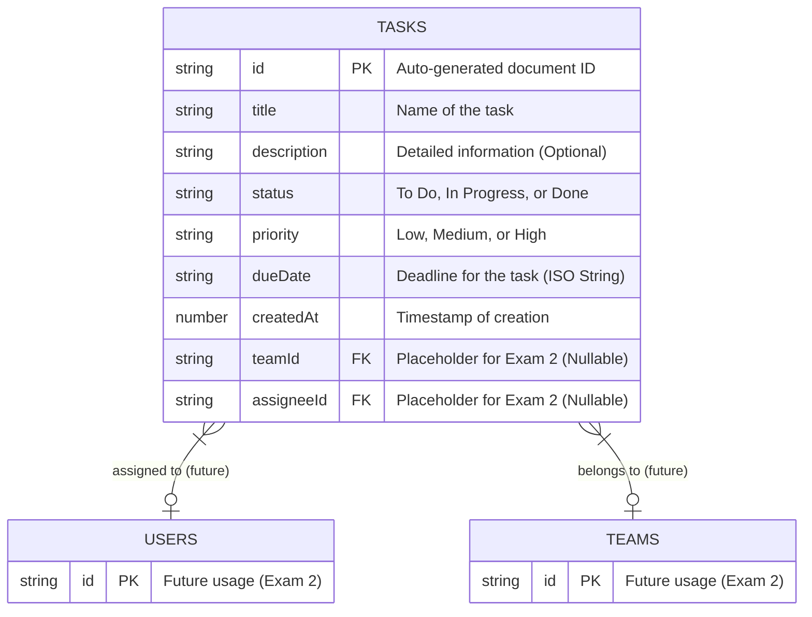

# Task Manager App

This is a mobile Task Management application built using React Native (Expo) and Firebase (Cloud Firestore) for data storage. It features a beautiful custom Dark Mode UI designed with React Native Paper.

## Features (Practical Exam 1)
- **Project Structure**: Organized screens, components, services, and navigation.
- **Task CRUD**: Create, read, update, and delete tasks directly from the Home screen.
- **Real-time Sync**: Firestore `onSnapshot` is used to keep the task list updated in real-time.
- **Bonus UI**: Custom Dark Theme and a status filter for easily managing tasks.

## Firestore Data Model (ERD)

Below is the Entity Relationship Diagram / Schema of the Firestore database structure used in this application.

## Running the App Locally

1. Install dependencies: `npm install`
2. Start the Expo server: `npx expo start`
3. Scan the QR code with Expo Go on your mobile device (or press `a` for Android Emulator / `i` for iOS Simulator).
